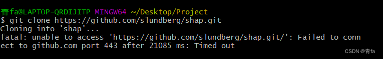
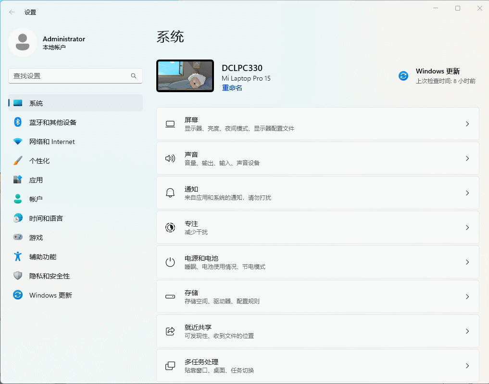
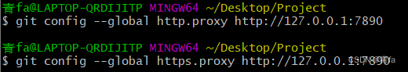

一、问题描述
如下图所示，无法 git clone 来自 Github 上的仓库，报端口 443 错误

二、问题分析
Git 所设端口与系统代理不一致，需重新设置

三、解决方法
3-1、打开代理页面
打开 设置 --> 网络与Internet --> 查找代理

动图
记录下当前系统代理的 IP 地址和端口号

如上图所示，地址与端口号为：127.0.0.1:7890

3-2、修改 Git 的网络设置
# 注意修改成自己的IP和端口号
git config --global http.proxy http://127.0.0.1:7890 
git config --global https.proxy http://127.0.0.1:7890

四、完结撒花
可以重新 clone 尝试了（其实主要解决的是为啥搭建了梯子依旧不好使的问题，哈哈哈）

五、后记
当我们访问GitHub的时候一般都会使用梯子，所以往上推代码的时候也是需要梯子，没有梯子推送成功概率很低，一般都会报错超时，所以设置梯子提高访问成功率；

取消代理是因为，访问 Gitee 或其它是不需要梯子，所以要取消代理；或者后悔设置代理了，也可以利用此取消

# 取消代理
git config --global --unset http.proxy
git config --global --unset https.proxy

# 查看代理
git config --global --get http.proxy
git config --global --get https.proxy